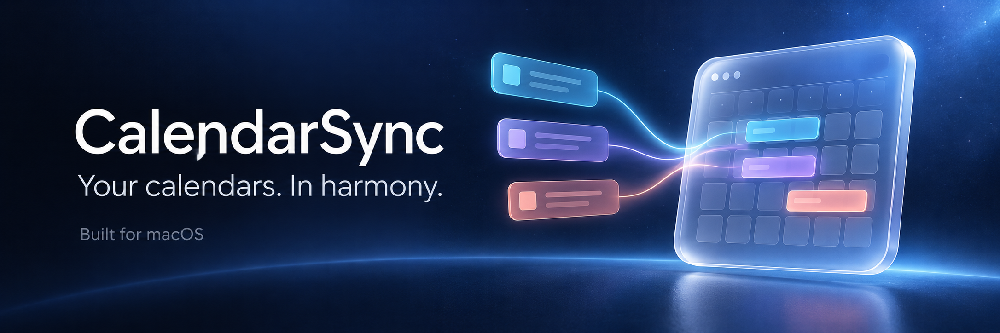

<div align="center">
  
  <br /><br />
  <a href="#getting-started"></a>
  <a href="#development"></a>
  <a href="#privacy-and-storage"></a>
  <a href="LICENSE"></a>
  <br /><br />
  <strong>One clear schedule. Availability shared across your accounts.</strong>
  <p>A native macOS utility for bringing multiple calendars together,<br />with private Busy blocks, scheduled syncing, and explicit rollback.</p>
  <a href="#getting-started">Get started</a> ·
  <a href="#configure-your-calendars">Configure calendars</a> ·
  <a href="#scheduled-sync">Schedule sync</a> ·
  <a href="docs/recovery.md">Recovery guide</a>
</div>

<br />

## Why CalendarSync?

A meeting on one account does not automatically reserve that time on another. CalendarSync works with the calendars already configured on your Mac to keep your availability aligned and create a combined view of your schedule.

Apple Calendar remains your calendar app. CalendarSync reads selected source events through EventKit, maintains copies in dedicated output calendars, and writes anonymous **Busy** blocks into other participating calendars. Your original source events stay untouched.

| Capability | What you can do |
| :--- | :--- |
| **A unified schedule** | Combine sources into one output, or map them to several output calendars. |
| **Cross-account availability** | Reserve occupied time in other selected writable calendars with anonymous Busy blocks. |
| **Flexible source roles** | Choose calendars that share availability, calendars that only appear in the combined view, and calendars to ignore. |
| **Source colors** | Use separate output calendars with matching colors, or group several sources into one output. |
| **A bounded sync window** | Look ahead 1–36 calendar months, with an optional past range. |
| **Preview and recovery** | Inspect planned changes before applying them and roll back verified changes from the latest sync. |
| **Daily automation** | Run once a day or at up to eight local times, even with the app closed. |
| **Menu bar mode** | Keep CalendarSync within reach while hiding its window and Dock icon. |

## A simple example

Suppose **Work A** has a meeting from 10:00 to 11:00, and **Work A** and **Work B** both use the **Block + view** role.

| Calendar | Result at 10:00–11:00 |
| :--- | :--- |
| Work A | Your original meeting stays as it is. |
| Work B | CalendarSync creates an anonymous **Busy** block. |
| Unified output | CalendarSync creates a copy of the meeting for your combined view. |

Busy blocks contain the time interval, Busy availability, and an ownership marker. They do not include the source event's title, notes, location, or attendees. Unified copies contain event details, so choose output calendars with appropriate visibility.

## Getting started

### Requirements

- **macOS 14 or later.**
- **Swift 6 or later**, from Xcode or Apple's Command Line Tools. Full Xcode is optional.
- Calendar accounts already configured on your Mac and visible in Apple Calendar.
- Full Calendar Access for CalendarSync, plus writable calendars for outputs and availability blocks.

CalendarSync uses EventKit. It has no cloud backend and does not sign in directly to Google, Microsoft, or other calendar providers. Availability delivery depends on the account's support for EventKit writes; verify it with the built-in validation flow.

### Build and install

If you need Apple's Command Line Tools, install them first:

```sh
xcode-select --install
```

Clone the project, test it, and create the app bundle:

```sh
git clone https://github.com/rafaelolsr/calendar-sync.git
cd calendar-sync
sh Scripts/test.sh
sh Scripts/package-app.sh
```

The packaged app is created at **`.build/CalendarSync.app`**. In Finder, press **⇧⌘G**, enter the project's `.build` folder, and drag **CalendarSync.app** into **Applications**. Then launch it:

```sh
open /Applications/CalendarSync.app
```

Build again when the source code changes. Once installed, the app runs directly from Applications; daily sync does not rebuild it. Set up the schedule after placing the app in its permanent location.

> **Build troubleshooting:** If your SDK reports a missing `SwiftUIMacros` plug-in, see the [SDK workaround](docs/development.md#sdk-workaround). Locally packaged builds use ad hoc signing; distributing a downloadable app with a trusted developer signature and notarization requires a separate release setup.

## Configure your calendars

### 1. Grant access and assign roles

Open CalendarSync, grant Calendar Access, and refresh the calendar list. Assign each calendar a role:

| Role | Unified copy | Busy blocks in other Block + view calendars |
| :--- | :---: | :---: |
| **Block + view** | Yes | Yes, when eligible |
| **View only** | Yes | No |
| **Not included** | No | No |

Sources with the **Block + view** role also serve as Busy-block destinations when writable. A source never receives a blocker for its own event. Dedicated Unified outputs are excluded from sources and Busy-block destinations.

### 2. Choose your Unified outputs

Create dedicated output calendars in Apple Calendar, then choose an output mode in **Unified outputs → Copy events to**:

- **One calendar:** Send all included source events to a single combined calendar.
- **Map each source:** Assign an output beside each source. Multiple sources may share an output.

To retain distinct colors, create a separate output for each source and manually match its color in Apple Calendar. Event color comes from the destination calendar. Sources sharing an output will share its color.

Outputs must be writable and separate from all selected sources. Changing sources or destinations turns Automatic Blocking off so you can preview the new setup before enabling it again.

### 3. Set the window and preview

Choose **Sync window → Look ahead** in calendar months. Set **Include past** to **0** for upcoming events only, or include up to 30 past days. The initial defaults are seven past days and three months ahead.

Click **Preview changes** and inspect the proposed copies, blockers, and issues. Preview does not write calendar events. Reducing the window leaves existing generated events outside that window in place.

### 4. Validate before enabling writes

1. Open **Validate calendar** and select a writable work calendar and a future test time.
2. Create the temporary **CalendarSync Test - Busy** event.
3. Check it in Apple Calendar and verify that Outlook Scheduling Assistant shows the time as unavailable.
4. Click **Confirm Outlook shows Busy**, then delete the test event through CalendarSync.
5. Enable **Automatic Blocking** when ready and use **Sync now**.

Validation and Automatic Blocking are required before normal sync writes—including Unified copies. Validation alone does not enable syncing. Keep scheduling off until a manual run works as expected.

## Which events block time?

| Source event | Unified copy | Busy blocks |
| :--- | :---: | :---: |
| Busy or Out of Office | Yes | Yes, for eligible future events from Block + view sources |
| Free | Yes | No |
| Tentative | Yes | Only when **Include tentative events as busy** is enabled |
| Unknown availability | Yes | No |
| Declined or cancelled | No new copy | No new blocker |

All-day events follow their availability state. Recurring events are processed as individual occurrences returned by EventKit within the window. Past events can appear in Unified but do not create new Busy blocks.

Read the [sync behavior guide](docs/sync-behavior.md) for ownership checks, retries, remapping, and cleanup boundaries.

## Scheduled sync

In **Schedule**, choose **Daily** or **Several times daily**, select your local times, and click **Apply schedule**. Several-times mode supports up to eight times; the suggested times are **09:00, 13:00, and 17:00**. Select **Off** and apply to disable it.

CalendarSync registers a per-user macOS LaunchAgent that starts a separate window-free sync process. **The app does not need to stay open.** Scheduled runs use your saved calendar roles, mappings, window, and safety settings. Saving a schedule preserves those settings.

Your Mac must be on and you must be logged in. A trigger missed during sleep runs after wake; a shutdown waits for the next trigger. Times follow your Mac's current time zone. The Schedule panel shows the next run and latest result.

Scheduled sync pauses when Calendar Access, validation, or Automatic Blocking is missing, or when recovery is pending. It never prompts for permissions in the background. Keep the installed app at the same path; if you move it, reopen it and apply the schedule again.

## Menu bar mode

Click **Minimize to menu bar**, or press **⇧⌘M**, to hide the window and Dock icon. Click the calendar icon in the menu bar for **Open CalendarSync**, **Sync now**, and **Quit CalendarSync**.

**Show in Dock** restores the Dock icon. Menu bar mode is remembered separately from your calendar configuration. Quitting the interface does not stop an enabled schedule.

## Rollback and recovery

Use **Activity → Rollback latest sync…** to preview recovery, then confirm **Roll back verified changes**. Rollback removes events created by that sync and restores saved fields of generated events it updated or deleted. It turns Automatic Blocking off.

Only the latest sync that attempted changes has a rollback snapshot. Later syncs with writes replace it; previews and runs with no writes retain it. CalendarSync checks ownership and current fields before recovery. Edited or unverifiable events remain untouched and are reported for review.

Interrupted recovery can be resumed. A destination write error does not automatically undo successful writes. For complete recovery instructions, leftover cleanup, and explicitly removing all generated events, see the [recovery guide](docs/recovery.md).

## Privacy and storage

CalendarSync reads and writes through the local EventKit store. Account synchronization is handled by macOS and your calendar providers. The app has no additional server, provider OAuth flow, or analytics service.

| Local data | Location |
| :--- | :--- |
| Configuration, generated-event mappings, and recovery snapshots | `~/Library/Application Support/com.datageek.CalendarSync/recovery.json` |
| Latest aggregate scheduled-run report | `~/Library/Application Support/com.datageek.CalendarSync/scheduled-run.json` |
| Schedule registration | `~/Library/LaunchAgents/com.datageek.CalendarSync.scheduled-sync.plist` |

Recovery snapshots can contain copied event details. Keep them private and retain them while recovery is pending. Recovery and run-report files use user-only permissions. Diagnostics omit event titles, locations, notes, attendees, and conferencing details.

The repository excludes local builds, session state, calendar exports, recovery files, and diagnostic artifacts.

## Development

CalendarSync is a Swift Package with a SwiftUI interface, EventKit access, a reconciliation planner, and persistent recovery journals. It has no third-party package dependencies.

```sh
sh Scripts/test.sh
sh Scripts/package-app.sh
```

The tests cover reconciliation, destination mappings, sync windows, rollback, scheduling, and safety gates. Running the test suites does not sync your real calendars.

See the [development guide](docs/development.md) for the source layout, SDK workaround, and support commands. [SPEC.md](SPEC.md) records the original design; the README and focused guides describe the implemented behavior.

Contributions are welcome. For fixes, include a concrete before/after example and the relevant test result. Please use synthetic events and redact personal calendar information from issues and screenshots.

## License

[MIT](LICENSE) · Copyright © 2026 Rafael Rodrigues.
